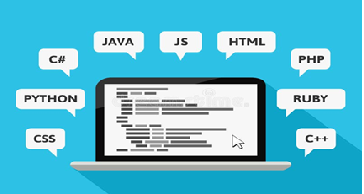
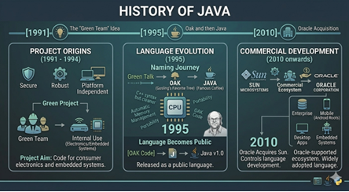

# LANGUAGE

It is a medium to communicate between two entities.

---
# PROGRAMMING LANGUAGE

A language or medium which is used to communicate or instruct a computer to perform a specific task is known as a programming language.

---
# TYPES OF PROGRAMMING LANGUAGE

There are 3 types of programming language:

1. Machine level / Low level language  
2. Assembly level / Mid-level language  
3. High level language  

---

## 1. Machine Level / Low Level Language

A language understandable, readable, and executable by a machine is known as machine level language.

**Example:** Binary language (consists of 0 and 1)

- Easy and friendly for machines  
- Very difficult for humans to understand  

---

## 2. Assembly Level / Mid-Level Language

Assembly level language consists of predefined words called **instruction sets** or **mnemonics**.

We have **8086 instruction sets**.

**Examples:**
- `ADD` → Used to add two numbers  
- `MOV` → Move data from one memory location to another  
- `SUB` → Used to subtract two numbers  

These mnemonics are not understandable by machines directly.  
They must be converted into machine language using software called an **Assembler**.

---

## 3. High Level Language

A language similar to English that is easy, readable, and understandable for programmers.

- Easy for humans  
- Hard for machines  

Converted into machine language using:
- **Compiler**
- **Interpreter**

**Examples:** Java, C, C++, Python

---
![] (image/3.png)

# HISTORY OF JAVA

**Inventor:** James Gosling  

**Aim:**  
To create a language that is:
- Robust  
- Platform independent  
- Secure  
- Suitable for electronics and embedded systems  

### Key Points:

1. A group of engineers called the **Green Team**  
2. Project name: **Green Project**  
3. Language names:
   - Green Talk  
   - Oak (named after oak tree)  
   - Java (named after coffee)  
4. Company: **Sun Microsystems**  
5. Started in **1991** (internal project)  
6. Became public in **1995**  
7. Acquired by **Oracle** around **2010**

---
# FEATURES OF JAVA

## Easy Way to Remember (Exam Trick)

**"SOP SPHMRDD"**

- **S** – Simple  
- **O** – Object-Oriented  
- **P** – Platform Independent  
- **S** – Secure  
- **P** – Portable  
- **H** – High Performance  
- **M** – Multithreaded  
- **R** – Robust  
- **D** – Distributed  
- **D** – Dynamic  

---