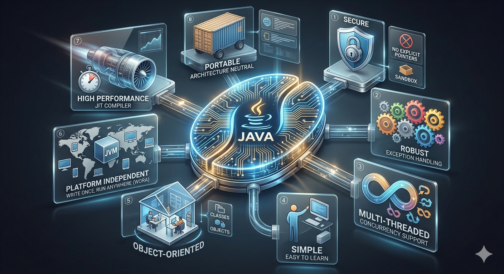

# ☕ Features of Java

---

  

## 🌐 Java is a high-level programming language  
## 🧩 Java is an object-oriented programming language    

#🧩 Object

An object is anything that exists in the real world.

- Java helps us represent real-world objects in an application  

### 📦 Example:

- In Amazon, we can buy any object  
- When we search for an object (like a laptop), we can see:
  - Image  
  - Features of that particular object  

👉 Here, object means anything such as:
- Laptop  
- Chair  
- Book  

---

## 🏗️ Class-Based Language

- Java is a **class-based language**  
- We write the entire Java program inside a **class**  

---

## 🌐 Platform Independent

- Java is a **platform-independent language**  

👉 A program written in Java can run on:
- Windows  
- Mac  
- Linux  

✔ Without changing the code  

---

### ⚙️ Platform

- Platform is a combination of:
  - Hardware  
  - Software  

### 🔄 How does Java achieve this?

Java uses something called **JVM (Java Virtual Machine)**  

#### Step-by-step:

1. You write Java code  
2. It is compiled into **bytecode** (not machine code)  
3. This bytecode runs on the **JVM**  

👉 JVM is available on all platforms  

### 🏆 Famous Slogan

👉 **"Write Once, Run Anywhere (WORA)"**

### ⚠️ Important Note

- Java is **platform independent at runtime**  
- But JVM is **platform dependent** (each OS has its own JVM)  

### ✅ Summary

- Java is platform independent  
- Because of JVM  
- Same code runs everywhere  

---

## 🔤 Case Sensitive Language

- Java is a **case-sensitive language**  

👉 This means:
- Uppercase and lowercase letters are treated differently  
- Must use exact spelling and case  

---

## ⚡ Multithreaded Language

- Java is a **multithreaded language**  

👉 It supports multiple tasks running at the same time  

### 📦 Example:

- Amazon → multiple people use the same application at the same time  

---

## 😊 Simple Language

- Java is a **simple language**  

👉 Because:
- Complex features like **pointers** are not available in Java  

---

## 🔐 Secure Language

- Java is a **secure language**  

👉 It provides built-in features to:
- Protect data  
- Prevent unauthorized access  

### 🏦 Example:

- In banking applications, access is allowed only after:
  - Password  
  - Account details  

---

## 💪 Robust Language

- Java is a **robust (strong) language**  

👉 It does not crash easily  

👉 Java achieves robustness by:
- Checking errors during:
  - Compilation time  
  - Runtime  

---