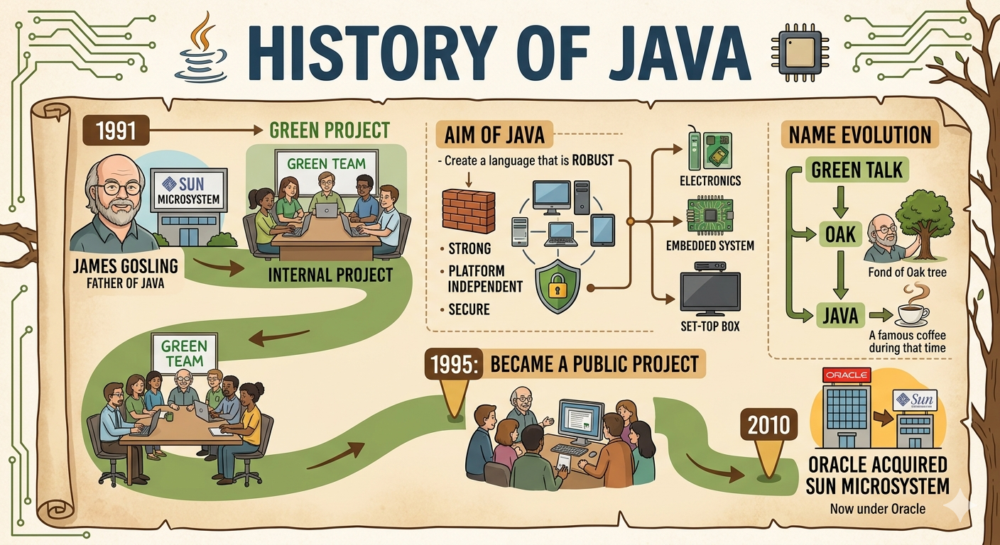

## ☕ History of JAVA

  

- 👨‍💻 Father of JAVA: James Gosling  

---

### 🎯 AIM

- To create a language which is robust, platform independent, secure  
which will be used to communicate or program with electronics, embedded  
system, set-up boxes.  

---

### 👥 Team

- Group of engineers worked together is Green team.  

---

### 🌱 Project

- Name of the project: Green project  

---

### 🔤 Language Evolution

- Name of language first created is Green talk then changed into oak (fond of  
oak tree by James Gosling) then to Java (a famous coffee during that time).  

---

### 🏢 Company

- Company Name: Sun Microsystem.  

---

### 📅 Timeline

- It started in the year 1991 as an internal project.  
- By 1995 it became a public project.  
- Around 2010 Oracle acquired the Sun Microsystem and now the project is  
under oracle.  

---