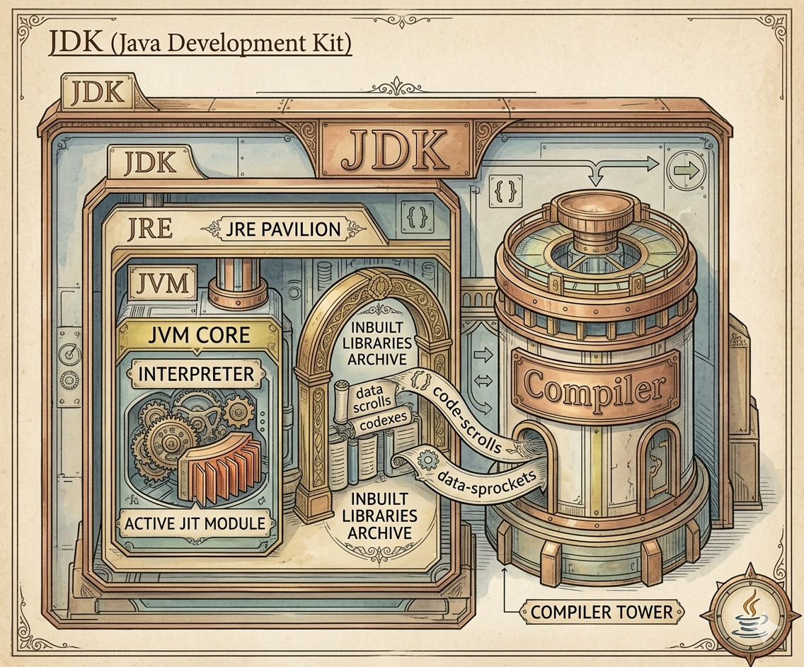

## ⚙️ Java Development Kit

  

- Kit means everything will be present inside that.  
- eg: medical kit, cricket kit  

---

### ☕ JDK (Java Development Kit)

- It provides an environment to run and develop the Java program  
- It is physically exists  
- Consists of JRE and compiler  

---

### 🔄 JRE (Java Run Time Execution)

- It provides an environment to run a Java program  
- It consists of JVM and inbuilt libraries  
- It is physically exists  

---

### 🧠 JVM (Java Virtual Machine)

- Consist of JIT and interpreter  
- Physically does not exist  

---

### ⚡ JIT (Just In Time)

- It is a part of interpreter  
- It will speed up the part of interpretation  

---