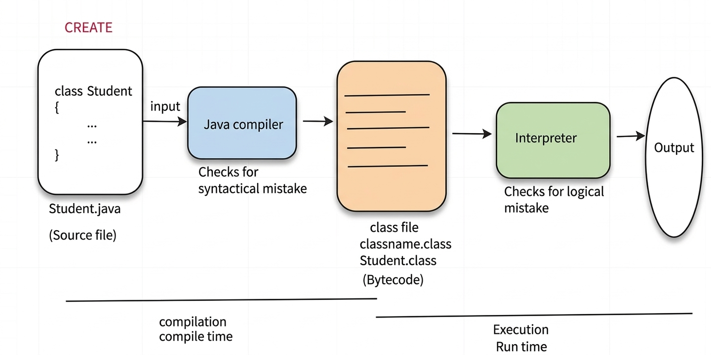

# ☕ How Java Programs Work:

  

---

## 📄 Source File

- The file where we write our Java program.  
- Class name and file name should be same.  
- Source file is passed as the input to Java compiler.  

---

## ⚙️ Java Compiler

- It is a software.  
- Takes source file as the input.  
- Checks for syntactical mistakes. If any error is found, compiler will throw **compile time error**.  
- It will convert the source file into class file.  

---

## 📦 Class File

- It consists of intermediate language known as **byte code**.  
- The name of class file will be automatically given by compiler and the name would be same as that of class name.  
- The extension for class file is **`.class`**.  

---

## 🔢 Byte Code

- Code that is neither understandable by the machine nor by the human.  

---

## 🧠 Interpreter

- It is a software.  
- Interpreter executes the code line by line and produces the output.  
- It checks for logical mistakes.  
- If any logical mistakes are there, it will not produce output.  

---

## 🔄 Process Explanation

- The process of converting source file to class file is known as **Compilation**.  
- The time taken for compilation is known as **Compile Time**.  

- The process of converting class file to output is known as **Execution**.  
- The time taken for execution is known as **Run Time**.  